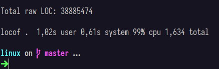
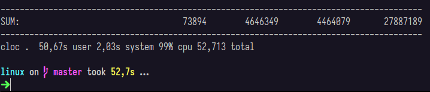

# LOCOF - Lines Of Code Of
This is a CLI tool to count the lines of code (LOC) in a given directory written in Rust.
Inspired in the [cloc](https://github.com/AlDanial/cloc) tool.
This is not meant to be a replacement for cloc.

Note that this is an early-stage prototype, so functionality may be limited, and breaking changes may occur as development progresses.

# Installation and Usage
Ensure that you have Rust installed on your machine. If you don't have it, you can install it by following the instructions on the [official website](https://www.rust-lang.org/tools/install).

Clone this repository by running:
```bash
$ git clone --depth=1 https://github.com/lucasbombarda/locof
```

In Windows or Linux, if you want to run the tool without installing it, you can run:
```bash
$ cargo run --release -- <path>
```

Alternatively, you can install the tool by running the following command:
```bash
$ cargo install --path .
```

Then, you can run:
```bash
$ locof <path>
```

# Performance
Now, it's single-threaded and it's not optimized, and still is WAY faster than cloc.
Note that locof isn't considering the same things as cloc, like .gitignore files, for example.
Here are some benchmarks on Linux kernel source code:
- locof:


- cloc:


# Roadmap
- [ ] Count the lines of code, comments and blank lines in a given directory
- [ ] Add `--exclude-dir` and `--exclude-ext` flags
- [ ] Add support to .gitignore files
- [ ] Output in JSON format
- [ ] Multi-threading

# License
This project is licensed under the MIT License - see the [LICENSE](LICENSE) file for details.
